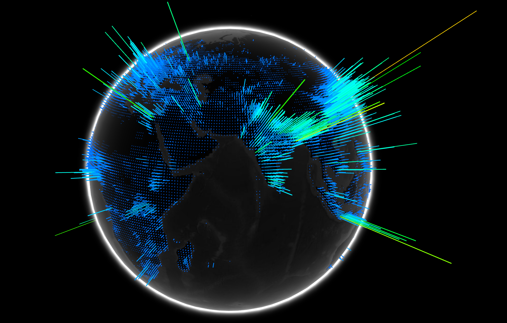
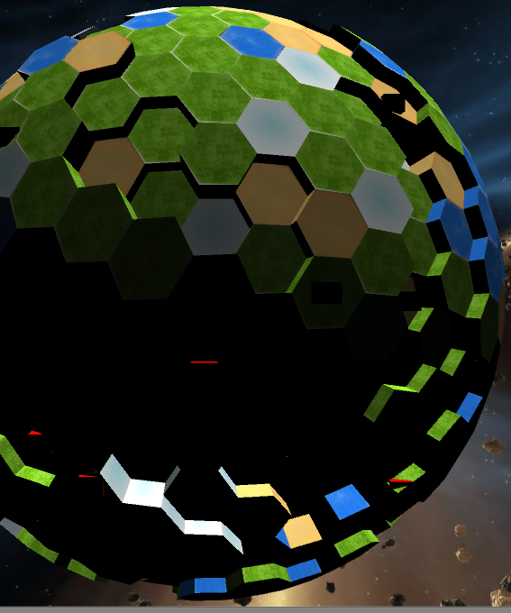
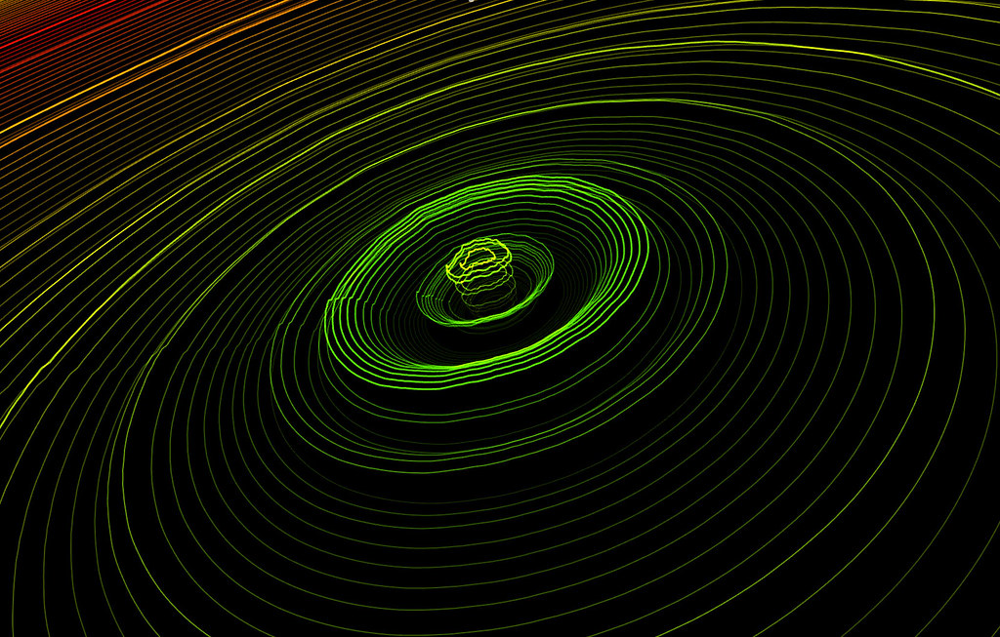

# SphereVis

## Student Info:
**Student Name**: Igor Bolek

**Student Number**: C17487376

**Course**: DT228/4  **|**  TU856/4

# Description of the project

SphereVis is an audio visualizer that takes a form of a sphere made out of 8192 hexagon models.
As the audio track plays, the hexagon's Y scale increases representing the audio spectrum.
There is a fog around the sphere and lights inside the sphere to create a nice planet eruption visual effect.

Image of SphereVis in Action:

Video Demonstration using song "Deviant" by DEADLIFE:

# Instructions for use

1. When Cloned/Downloaded from this repository, open the `SphereVis` folder in Unity as a project.
2. Open the `SphereVisScene` scene and run.
3. 8192 is a high number for computers without a dedicated GPU, In the Unity player that was around 30 fps, but when built and ran, I got stable 60+ fps (clamped by vsync)
4. To reduce the size, adjust the `frameSize` in AudioSampler and `size` HexaSphere GameObjects. They must be the same value.
5. To increase/decrease size of the hexagons in x and z axis, Increase the divisor on line 29 in HexaSphere.cs script. Default is `4.0f`
6. Lastly, to change a song, Drag it from Music directory to `Track` field in AudioSampler GameObject.

# How it works

# References

# What I am most proud of in the assignment

# Proposal submitted earlier can go here:

## Description
Simply: A Sphere that visualises music.

Sounds simple, but it requires a lot of maths! 

First inspiration came from a WebGL globe. I want my sphere to shoot out hexagonal pillars depending on audio frequency. 

I would love to create something like that but on a hollow sphere, made of hexagons like so:

Once the sphere is made from hundreds of hexagons, and working, then the next step will be to add background waves like those:

When those 3 things are combined together, it will look interesting when looking how it reacts to music. I also plan to add a lot of lighting effects and transitions.

## Challenges
- Maths.. lot's of maths in every aspect of this project. 
- Time management, I'm hoping to achieve what I can within the little time we have between all assignments and FYP project.
- Learning Unity. Labs are great, but this will be the real challenge.

## References
[WebGL Globe](https://experiments.withgoogle.com/chrome/globe)

[Loop WaveForm](https://www.uberviz.io/viz/loop/)

[HexaSphere Thread](https://forum.unity.com/threads/make-procedural-hexagons-on-a-sphere-is-there-a-tool-voxels-perhaps.330907/)
